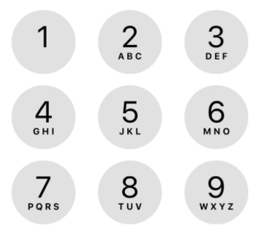

# Letter-Combination

### Given a phone number that contains digits 2-9, find all possible letter combinations the phone number could translate to.

#### Example:

Input: 56

Output: ["jm","jn","jo","km","kn","ko","lm","ln","lo"]
